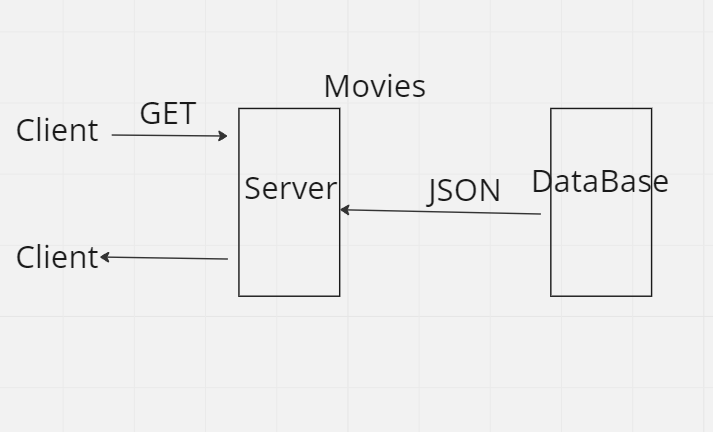

# Movie app Lab 13*

**Author Name**: Abdelrahman Maher Sweiti

WRRS

## Getting Started
first you make the repo add read me file and gitignore folder with node as template and MIS as license then you clone the repo to your machine then you initialise it by writting the command then you download the required packages then implement your code inside the server.file

## Project Features
it handles GET responses if the request is successful or not